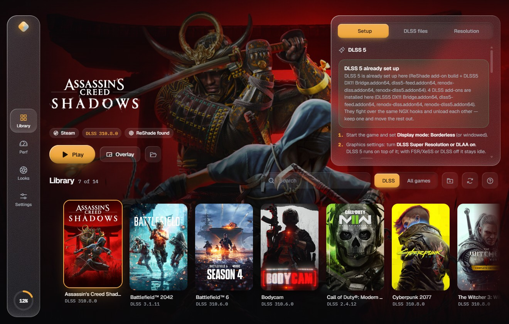
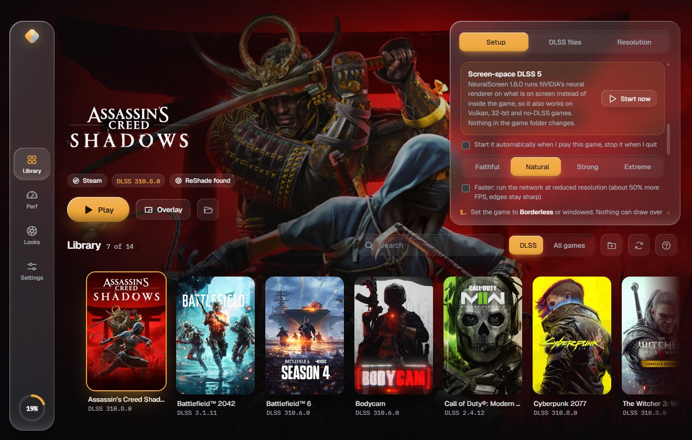
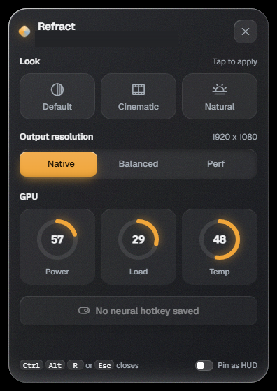
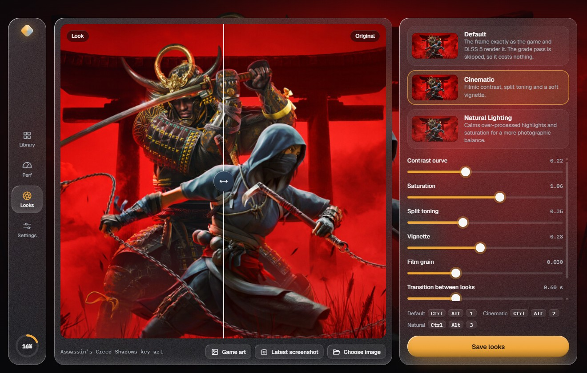
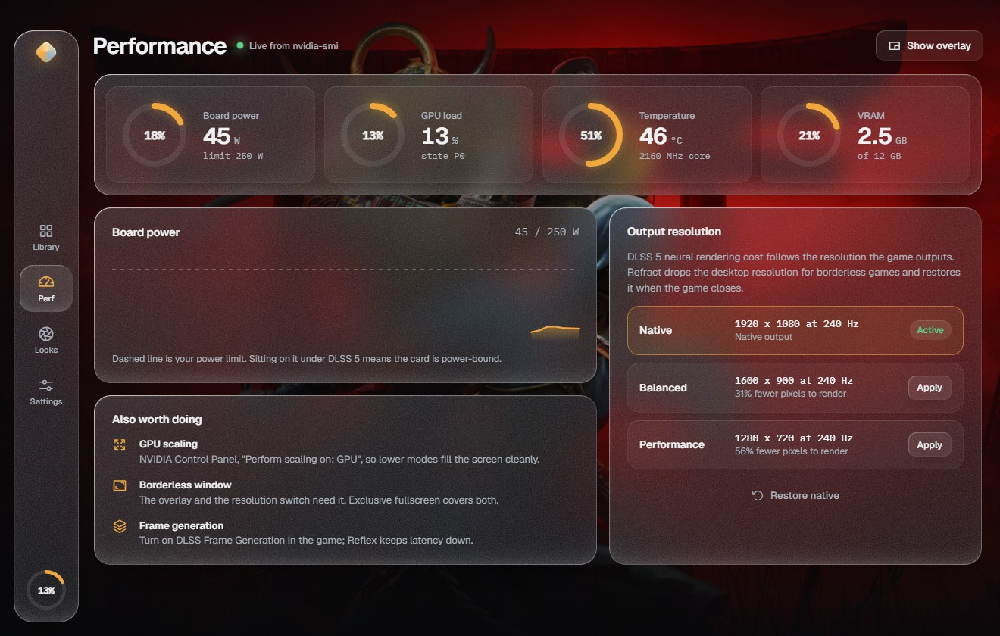
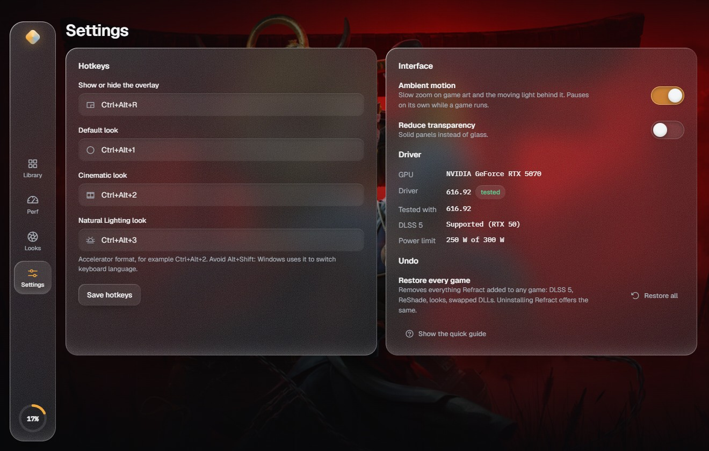

# Refract

A DLSS 5 companion for Windows and GeForce RTX 30/40/50 cards. It puts NVIDIA's DLSS 5 neural
renderer into games that never shipped with it, keeps track of every file it touches so any
change can be undone, and adds an in-game overlay, three live look presets and an
output-resolution governor.

Everything it needs is inside the installer. Enabling DLSS 5 in a game downloads nothing.



## Two engines

| | **In-game** | **Neural Screen** |
|---|---|---|
| How | ReShade add-on build + RenoDX DLSS 5 inside the game process | [NeuralScreen](https://github.com/perseval-BLR/DLSS5-NeuralScreen) captures the screen (or one window) and processes it outside the game |
| Works with | DX12 and DX11 games, with or without their own DLSS | Anything on screen: Vulkan, 32-bit, no DLSS, emulators, video |
| Game files | ReShade, the add-on and the runtime are added next to the exe (backed up, removable) | Nothing is written to the game folder |
| Cost | Neural rendering on top of the game's own DLSS | A second full-screen pass: 40–60 ms of latency, not for competitive play |
| Anti-cheat | Risky, as any ReShade add-on is | Do not use it in online games at all |

Each game picks its engine in its **Setup** tab. Neural Screen can start and stop with the game.



## GPU support

DLSS 5 neural rendering officially requires Blackwell. The runtime Refract bundles is the
universal 310.8 build: it carries `sm_75/86/89/120` kernels and its architecture gate accepts
Ampere, Ada and Blackwell.

| Card | DLSS 5 | Notes |
|---|---|---|
| RTX 50 (Blackwell) | Yes | Supported by NVIDIA. Verified in Cyberpunk 2077 on an RTX 5070, driver 616.92 |
| RTX 40 (Ada) | Yes | Community path. Not tested on this hardware |
| RTX 30 (Ampere) | Yes | Community path. Not tested on this hardware |
| RTX 20 (Turing) | No | Every known runtime refuses the Turing architecture (0x160), so Refract says so instead of installing something that stays off |
| GTX and older | No | No DLSS hardware |

On RTX 30/40 the frame-rate cost is much higher than on RTX 50, and it is the *output*
resolution that sets the cost.

## Install

Builds are not published: the installer contains third-party and modified NVIDIA binaries.
Build it yourself (see [Build](#build)), or get the installer from someone who did.

The app installs per user, needs no admin rights, and writes only to its own folder and
`%APPDATA%\Refract`.

## Using it

**In-game DLSS 5**

1. Pick the game, open **Setup**, click **Enable DLSS 5**. Refract detects the render API and
   picks a route: native (DX12 with DLSS), native + bridge (DX11 with DLSS), feeder (no DLSS at
   all), or reports the game as unsupported (Vulkan, 32-bit, legacy).
2. In the game: **Display mode Borderless** (or windowed), and **DLSS Super Resolution or DLAA
   on** — DLSS 5 runs on top of it and stays idle with FSR/XeSS or DLSS off.
3. In the game press **Home** for ReShade → **Add-ons** → RenoDX to tune it. **F6** toggles
   neural rendering, **F5** shows an A/B split.

**Neural Screen**

1. Open **Setup** → **Neural Screen** → **Start now**, or tick *Start it automatically when I
   play this game*.
2. Borderless or windowed, SDR display (`Win`+`Alt`+`B` toggles HDR off).
3. With **Num Lock on**: `Num2` menu, `Num1` neural rendering on/off, `Num5` process only the
   window under the cursor, `Num3` screenshot, `Num0` record, `Ctrl`+`Alt`+`Q` quit.

**The overlay** — `Ctrl`+`Alt`+`R` in a borderless game opens a glass panel with the looks, the
output tier and live GPU rings. `Esc` or the hotkey closes it and hands focus back to the game;
*Pin as HUD* leaves it on screen with clicks passing through. Alt+Shift combinations are avoided
because Windows uses them to switch keyboard layout; if the hotkey is taken, Refract falls back
to another one and tells you which.



**Looks** — `Refract.fx` adds three looks to the game's existing ReShade preset: Default (no
grade pass, costs nothing), Cinematic and Natural Lighting, switched live with
`Ctrl`+`Alt`+`1/2/3` or from the overlay. Preview them on your own screenshots first.



**Output resolution** — DLSS 5's cost follows the resolution the game outputs. Refract shows
live board power against your limit and can drop the desktop resolution (Balanced / Performance)
for borderless games, restoring native when the game exits.



## Undoing everything

Every install is recorded in a manifest next to the game (`refract-feeder.json`,
`refract-reshade.json`) with backups of anything replaced.

- **Restore original** on a game removes exactly what Refract added and puts back what it replaced.
- **Settings → Restore all** does the same for every game.
- The uninstaller offers to do the same before it removes the app.

Restores are surgical: settings changed since the install (DLSS 5 tuning, key bindings) are kept.



## How it works

| Piece | Mechanism |
|---|---|
| Game discovery | Steam (`libraryfolders.vdf` + `appmanifest`), Epic, GOG, Ubisoft, EA, Xbox, Battle.net, plus folders you add. Key art comes from Steam's own cache through a private `refract-art://` scheme |
| Render API detection | PE import table → Agility SDK `D3D12Core` → engine DLLs → a bounded string scan. Vulkan and 32-bit games are reported, not "fixed" |
| DLSS 5 install | Additive and all-or-nothing: ReShade's add-on build as the game's proxy DLL, the RenoDX add-on, the neural-rendering runtime and a tuned `ReShade.ini`. The game's own Streamline/NGX DLLs are never overwritten |
| Neural-rendering runtime | Games don't ship `nvngx_dlssnr.dll`; without it the add-on logs *"nvngx_dlssnr.dll was not found … NR stays off"*. Refract provides the universal build, backing up anything it replaces |
| Bundled payload | `payload/manifest.json` lists every bundled file with its SHA-256. A file is used only if its hash matches; otherwise Refract falls back to the pinned download |
| Neural Screen | Runs from a working copy in `%APPDATA%\Refract\neuralscreen` (its config, log and recordings survive updates); the 158 MB runtime is hard-linked, not duplicated |
| Session tracking | A PowerShell helper reports process count and visible windows, so "Running" clears when you quit even if the game lingers in the background |
| Display tiers | `EnumDisplaySettings` / `ChangeDisplaySettingsEx`, dynamic only — never written to the registry, so Windows reverts it even if Refract crashes |
| Looks | `WM_KEYDOWN` F13/F14/F15 posted to the game window; `Refract.fx` reads them through ReShade `source = "key"` uniforms |

## What is bundled

| Component | Version | Source |
|---|---|---|
| ReShade (add-on build) | 6.8.0 | [reshade.me](https://reshade.me) |
| RenoDX DLSS 5 add-on | 4.70 | [RankFTW/rhi-repo](https://github.com/RankFTW/rhi-repo) |
| DLSS 5 DX11 bridge | 1.4.12 | [NIGos/dlss5-dx11-bridge](https://github.com/NIGos/dlss5-dx11-bridge) |
| DLSS5-Feeder | 0.15.1 | [jlrouzies-fr/DLSS5-Feeder](https://github.com/jlrouzies-fr/DLSS5-Feeder) |
| LumeniteFX | mainline | [umar-afzaal/LumeniteFX](https://github.com/umar-afzaal/LumeniteFX) |
| Streamline runtime | latest | [yumlevi/renodx-dlss-installer](https://github.com/yumlevi/renodx-dlss-installer) |
| NeuralScreen (engine + `nvngx_dlssnr.dll` 310.8) | 1.6.0 | [perseval-BLR/DLSS5-NeuralScreen](https://github.com/perseval-BLR/DLSS5-NeuralScreen) |

`scripts/fetch-payload.js` downloads each one at build time, checks it against a pinned
SHA-256 and lays it out under `payload/`, which is never committed.

### The released installer is the lite build

One file is deliberately **not** inside the public installer: `nvngx_dlssnr.dll`, NVIDIA's
310.8 neural-rendering runtime. It is not ours to redistribute, so Refract downloads it from
[NeuralScreen's own release](https://github.com/perseval-BLR/DLSS5-NeuralScreen/releases) the
first time you enable DLSS 5 or start Neural Screen, checks it against a pinned SHA-256, and
caches it under `%APPDATA%\Refract`. Nothing else differs — same app, same features, same
payload. The only thing you notice is one download on first use.

`npm run dist` builds with the runtime inside (local use); `npm run dist:lite` builds the
redistributable one, and its self-test asserts that the runtime is *absent* so a full build can
never be published by mistake.

## Build

```powershell
npm install
npm run payload   # fetch + hash-verify every bundled component into payload/ (NeuralScreen is 224 MB)
npm run dist      # payload + NSIS installer in dist/
```

To avoid the NeuralScreen download, drop `neuralscreen-v1.6.0-full.zip` into
`%APPDATA%\Refract\dlss5\` first; the hash is checked either way.

## Verify

```powershell
npm test          # 49 unit tests: routes, installs and restores, GPU tiers, runtime rules, sessions, the helper
npm run selftest  # 21 end-to-end checks on this PC, writes screenshots + report.json
```

`selftest` changes nothing permanent: display modes are validated with `CDS_TEST`, and DLL
swaps and installs run on temp copies. It checks the GPU and driver, the Windows helper, the
display tiers, the library scan, DLL versions, swap/restore, the DLSS 5 install/restore cycle,
the bundled payload's hashes, the Neural Screen engine, shader compilation with
`d3dcompiler_47`, telemetry, every screen, the overlay and key delivery.

## If something is not working

**On an RTX 30 or RTX 40 card, Refract tells you itself.** Those two generations are the ones
this project has no hardware to test on, so when DLSS 5 does not run there — a verification that
fails after an install, or a play session whose ReShade log says the pass never happened —
Refract writes a report onto your Desktop by itself:

```
Refract-error-NVIDIA-GeForce-RTX-3060-2026-09-12.log
Refract-error-NVIDIA-GeForce-RTX-3060-2026-09-12.zip   (the full diagnostics bundle)
```

The log is plain text: your card and driver, the game and route, the exact failure and the log
line behind it, every install check with the ones that failed marked, the DLLs in the game folder
with sizes and hashes, anything Windows Defender removed, and numbered steps to try. Paths are
replaced with `%USERPROFILE%` and your account name with `<user>` before it is written. One file
per card per day; the same failure is never written twice. Settings → **Error report on the
Desktop → Write now** produces the same file on demand.


**The game looks the same.** Check the game's `ReShade.log`. `nvngx_dlssnr.dll was not found`
means the runtime is missing — click **Repair**. `evaluation succeeded` means neural rendering is
running; the effect is subtle at default settings, so press `F5` in the ReShade RenoDX tab for
an A/B split.

**The game crashes with "out of memory".** Neural rendering needs extra VRAM and system memory.
Close browsers and other heavy apps, and lower Path Tracing and Frame Generation first.

**The overlay doesn't appear.** Exclusive fullscreen cannot have anything drawn over it; switch
to borderless. If the hotkey is taken by something else, Settings shows the fallback in use.

**Neural Screen does nothing.** Num Lock has to be on for its numpad hotkeys. It also needs an
SDR display and borderless/windowed mode.

**"Running" never clears.** Fixed in 0.3.0 (0.1 shipped a helper that never started in installed
builds). You can always clear a session by hand from the game's card.

## Limits

- The overlay and resolution switching need borderless or windowed mode.
- The installer contains third-party and NVIDIA-derived binaries, including a modified
  `nvngx_dlssnr.dll`. Keep builds private; do not redistribute them.
- On RTX 30/40 this is community tooling, not an official NVIDIA path. Results vary by game.
- Neural Screen adds 40–60 ms of latency and must not be used in online games with anti-cheat.
- HDR is not supported by Neural Screen; the looks assume an SDR swap chain.

## Credits

Refract is a front end. The heavy lifting belongs to
[crosire](https://reshade.me) (ReShade), [RenoDX](https://github.com/clshortfuse/renodx) and the
RankFTW build of its DLSS 5 add-on, [DLSS5-Feeder](https://github.com/jlrouzies-fr/DLSS5-Feeder),
[LumeniteFX](https://github.com/umar-afzaal/LumeniteFX),
[dlss5-dx11-bridge](https://github.com/NIGos/dlss5-dx11-bridge),
[1-Click-DLSS5](https://github.com/reiluisii/1-Click-DLSS5) and
[NeuralScreen](https://github.com/perseval-BLR/DLSS5-NeuralScreen).

## License

Refract's own code is MIT (see `LICENSE`). Every bundled component keeps its own license, and
NVIDIA's runtime is NVIDIA's.
